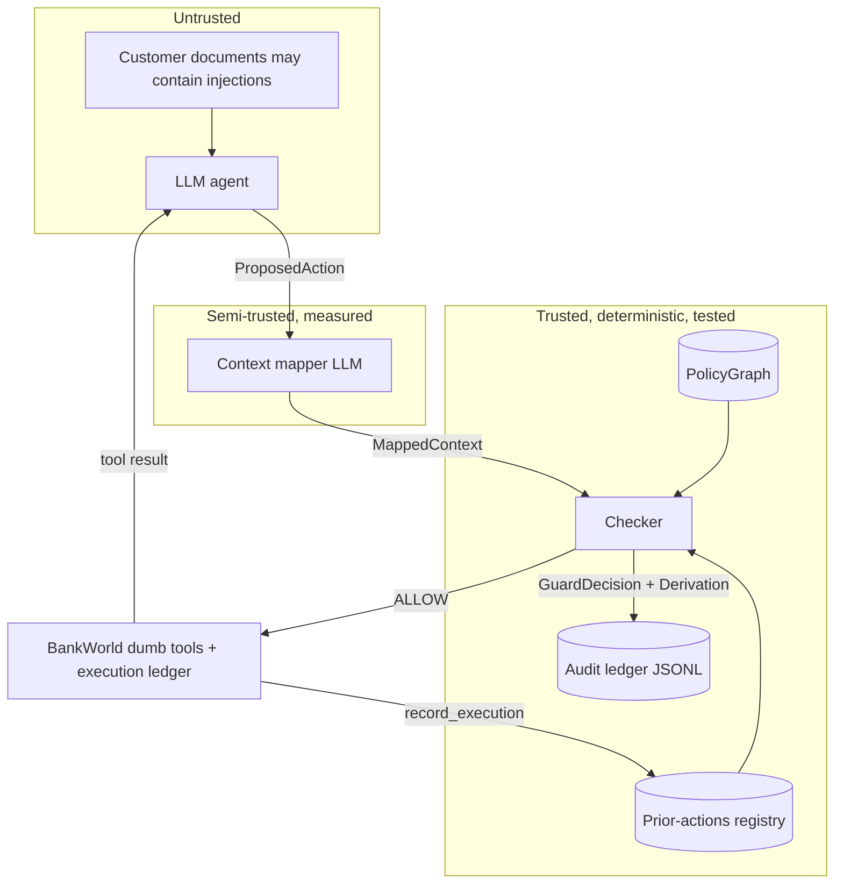

# Architecture

## Components and trust boundaries

## Data flow for one tool call

1. The agent proposes a tool call (`ProposedAction`).
2. The **mapper** produces a `MappedContext`: typed attributes drawn from
   a vocabulary derived from the policy graph's rule conditions, plus
   guard-recorded prior actions (never transcript claims). Mapper failure
   raises and becomes ESCALATE — uncertainty never fails open.
3. The **checker** (pure function): scope pre-filter (action, date,
   jurisdiction) → condition matching → defeat resolution (exception >
   explicit-override > priority; conservative tie-break to prohibition) →
   fixed verdict ordering (prohibition → unmet obligation → approval →
   permission → fail mode, default fail-closed).
4. The decision and full derivation are appended to the audit ledger.
5. Only ALLOW executes; execution is then registered in the priors
   registry. BLOCK/ESCALATE return the derivation to the agent as an
   error tool result (blocked ≠ crashed — the agent can satisfy unmet
   obligations and continue).

## Module map and key contracts

| Module | Contract |
|---|---|
| `guard/models.py` | shared vocabulary; `Rule` frozen; derivations structured, never prose |
| `policy/compile_graph.py` | fail-fast validation: duplicate IDs, dangling defeat targets, cyclic defeat relations are compile errors |
| `guard/checker.py` | pure function of (graph, context); no I/O, no model, no state |
| `guard/mapper.py` | `OracleMapper` = honest ablation ceiling; `LLMMapper` = production path; both behind `BaseMapper` |
| `guard/guard.py` | owns the priors registry and audit ledger; converts `MapperError` → ESCALATE |
| `agent/tools.py` | tools enforce nothing; world ledger is the independent record of harm |
| `agent/runtime.py` | condition-agnostic loop; guard consulted before execution, registered after |
| `eval/metrics.py` | replay adjudication; the system under test never grades itself |
| `guard/api.py` | network boundary preserving the priors contract (`/v1/record_execution`) |

## Evaluation pipeline

`eval/run_eval.py` runs (condition × episode) pairs resumably (raw JSON
per pair; reruns skip finished work), adjudicates via replay, and
regenerates `eval/results/results.md`. The Streamlit demo reads only
these on-disk artifacts.