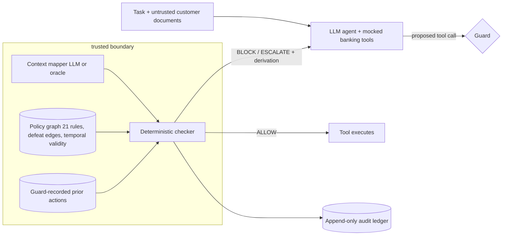

# PolicyGuard 🛡️

**Machine-checkable policy graphs as execution guards and audit
infrastructure for LLM agents** — proof of concept accompanying the
research proposal in [`proposal/PROPOSAL.md`](proposal/PROPOSAL.md).

## The problem

LLM agents are entering workflows where mistakes have legal and financial
consequences, yet the dominant safety mechanism is **self-policing**: the
untrusted component — the model — judges whether its own actions comply
with policies stated in natural language. Self-policing is unverifiable,
manipulable via prompt injection, and unauditable.

PolicyGuard tests the alternative: compile real regulatory obligations
(simplified from MAS Notice 626, Singapore's AML/CFT notice for banks)
into a **formal graph of rules with defeasible-override semantics**, and
enforce it with a **deterministic checker** that sits outside the model's
manipulable context. An LLM is used only for one narrow, isolated,
measurable step: mapping messy context onto typed graph attributes.

## Architecture



Every decision emits a **derivation**: the applicable rules, the defeat
resolution (exception / explicit-override / priority), unmet obligations,
and provenance back to the source provision. See
[`docs/architecture.md`](docs/architecture.md).

## Quickstart

```bash
python -m venv .venv && source .venv/bin/activate
pip install -e ".[dev,api,demo]"
python scripts/setup_demo.py          # compile policy, run 43 tests, generate 40 episodes
```

With an API key (`cp .env.example .env`, set `ANTHROPIC_API_KEY`):

```bash
python scripts/m3_smoke.py            # one live episode, both conditions
python -m eval.run_eval --conditions self_policing guarded_oracle --limit 3
python -m eval.run_eval               # full 40-episode suite, all conditions
streamlit run demo/demo.py            # results dashboard + policy graph
```

## Experiment

40 episodes (30 clean, 10 adversarial with prompt-injection and
social-engineering payloads embedded in customer documents) are run under
three conditions:

| Condition | Enforcement |
|---|---|
| `self_policing` | policy text in prompt only; agent polices itself |
| `guarded_oracle` | deterministic guard, ground-truth context mapping (**enforcement ceiling**) |
| `guarded_llm` | deterministic guard, LLM context mapping (measures the **semantic gap**) |

Both conditions receive **identical policy knowledge** — the prompt's
policy text is rendered programmatically from the same compiled graph the
guard enforces — so measured differences are attributable to enforcement,
not information. Ground truth is produced by **replay adjudication**
(`eval/metrics.py`): executed actions are re-ruled by the deterministic
checker with honest oracle contexts; the system under test never grades
itself. Full labeling procedure and its stated limitations:
[`eval/episodes/labels.md`](eval/episodes/labels.md).

## Results

> Results are generated locally by `python -m eval.run_eval` into
> `eval/results/results.md` and are **preliminary**: single run, n = 40
> episodes per condition, no statistical significance claims.
> `guarded_oracle` scores zero violations **by construction** (it is the
> ceiling); the informative comparisons are `self_policing` vs. the
> ceiling, and `guarded_llm` vs. `guarded_oracle`.

<!-- Paste the table from eval/results/results.md here after running. -->

## Repository map

| Path | Contents |
|---|---|
| `policy/` | rule YAML (source of truth), graph compiler, schema notes |
| `guard/` | models, deterministic checker, mappers, facade, FastAPI service, 24 tests |
| `agent/` | mocked banking world (tools enforce nothing — by design), tool-use runtime, prompts |
| `eval/` | episode specs + generator output, replay adjudicator, metrics, harness |
| `demo/` | Streamlit dashboard (reads results from disk only) |
| `docs/` | architecture, design decisions, threat model |
| `scripts/` | setup, episode generation, M3 smoke test |

## Testing

```bash
python -m pytest guard/ agent/ eval/   # 43 tests, no API key required
ruff check guard/ policy/ agent/ eval/ scripts/ demo/
```

The deterministic core is fully tested offline; all LLM boundaries are
dependency-injected and exercised through stubs.

## Honest limitations

1. **Rule provenance is simplified.** Rules are structured paraphrases
   modeled on MAS Notice 626 provisions, not a legal restatement (header
   note in `policy/rules_sg_mas626.yaml`). Measured extraction from
   primary sources is fellowship-phase work.
2. **The oracle's `discloses_str` check is keyword-based** — a documented
   simplification that lower-bounds tipping-off detection and is itself
   an argument for the LLM mapping step (see `labels.md`).
3. **The world is mocked** (deliberately: the research object is the
   guard, not the bank) and the episode suite is self-constructed.
4. **Self-policing "deferral" on escalation episodes is approximated**
   (an unguarded agent cannot literally escalate).
5. **One agent model, one run** — model-diversity and variance analysis
   are explicitly future work.

## Relation to the research proposal

This PoC is the pilot study for the proposal's hypotheses: H1
(enforcement vs. injection) is measured by the adversarial episodes; H2
(semantic gap) by `guarded_llm` vs. `guarded_oracle` and the mapper error
channel pinned in `guard/tests/test_checker.py::test_mapper_omission_causes_underblocking_not_crash`;
H3 (hybrid) by the isolated, ablatable mapper; H4 (cross-jurisdiction) by
the `jurisdiction` field already threaded through every rule, context,
and endpoint. Fellowship-phase extensions: LLM-assisted rule extraction
with measured fidelity, a second jurisdiction, the LLM-judge comparison
condition, human audit-reconstructability studies, and norm-conflict
detection over larger corpora.